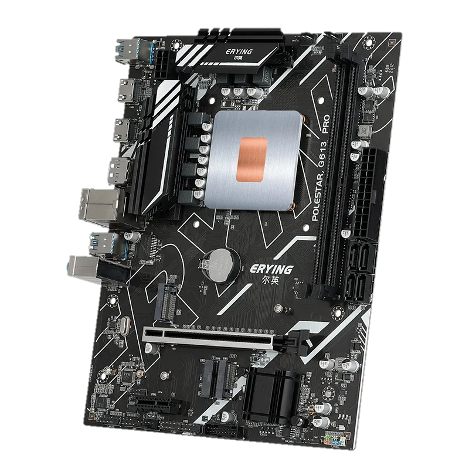

# ERYING-i9-11900H-ES-Hackintosh
**TEST-ONLY** EFI for the Erying M-ATX motherboard with the i9 11900H ES CPU

### ⚠️ Disclaimer:
- This EFI is meant to be for **TEST-ONLY**, I strongly do not recommend trying to use this efi for daily drive
- Use this EFI as an **example**, remember to always make your efi so you know how to fix it in case something breaks...
- This EFI will probably not be constantly updated to the latest version of opencore especially if no major changes are made
- Please read the whole readme before proceeding
- The the efi is not cleaned from garbage or useless things
- Please, Change the **[SMBIOS serial number](https://github.com/Forte500/ERYING-i9-11900H-ES-Hackintosh/tree/main#generating-smbios)** before using the EFI
##

### ⚠️ BIOS Disclaimer:
This efi is built based on the "Lightning BIOS", if you are still using the default bios be aware that you probably need to redo the USB Mapping process, + audio didn't worked at all for me with every codec for ALC 897.

If you decide to flash the lightning bios I **strongly recommend** to already have a bios programmer such as **CH341A**, It has happened to some people to have **bricked** their motherboard during this process

**[Lightning BIOS reddit post](https://www.reddit.com/r/EryingMotherboard/comments/12xg3n6/thoughts_on_the_more_powerful_bios/)**

### 💻 My Hardware
| Component      | Brand/info                                              |
|----------------|---------------------------------------------------------|
| **CPU**        | `Intel Core i9 11900H ES Tiger Lake-H`                  |
| **RAM**        | `16gb 2*8 Crucial ballistix 3200mhz`                    |
| **Storage 1**  | `500GB Crucial MX500`                                   |
| **Storage 2**  | `Crucial P3 Plus 1TB` (for Windows)                     |
| **iGPU**       | `Intel UHD graphics xe 32eus (vesa mode/disabled)`      |
| **dGPU**       | `XFX RX 6600 XT QICK 308`                               |
| **Audio**      | `ALC897 - layout 67(?)`                                 |
| **Ethernet**   | `Realtek Gigabit Ethernet`                              |
| **WiFi**       | `N/A (can be added)                                     |

### ✅️ What works</strong>

- GPU graphics acceleration RX 6600 XT with Resizable Bar Enabled
- Audio from rear jack & Monitor output with amd gpu, needs more testing (front speaker)
- USB ports
- Ethernet

### ❌️ What doesn't work

- Power management (WIP)
- front speaker audio jack
- Intel iGPU (no drivers)
- Sleep (probably related to Bios)
- **+ other things**

### ⚠️ Known Issues

- After Verbose, there's a blackscreen for 2-3 minutes when booting off amd gpu

### 👨‍🔧 For those who haves an unsupported GPU:

<strong></strong>

   
  
You can still try out MacOS without graphics acceleration by using the Intel igpu, just add `-wegnoegpu` to your bootargs

## ⚙️ Setup

<strong>🔧 BIOS Settings</strong>

   

**Advanced TAB**
- `SATA Configuration > SATA Mode Selection` must be set to **AHCI**
- `Graphics Configuration > VT-d`: should be **Enabled**
- `Graphics Configuration > Internal Graphics`: should be **Enabled**
- `Graphics Configuration > Primary Display`: should be set to **Auto**
- `PCI Subsystem Settings > Above 4G Decoding & Re-Size BAR Support`: must be **Both Enabled**
- `USB Configuration > XHCI Hand-off`: must be **Enabled**

**Startup TAB**
- `Fast Boot`: **Disabled**

**Security TAB**
- `Secure Boot > Secure Boot`: must be **Disabled**

<strong>🗒 config.plist edits</strong>

   
  
- ### Default keyboard layout and language:
 *optional:* edit `prev-lang:kbd` in config.plist in order to match your keyboard layout and language (mainly relevant in recovery and installation)
  
  default is (<>) which will force the Language Picker to appear at first boot up.
  More info [here](https://dortania.github.io/OpenCore-Install-Guide/config-laptop.plist/coffee-lake.html#add-4) at the bottom of `7C436110...` etc.
  
  
- ### Generating SMBIOS:

We need a tool, called [GenSMBIOS](https://github.com/corpnewt/GenSMBIOS) from corpnewt, to generate a fake serial number, UUID and MLB for our Hackintosh.

**this step is mandatory to get working iServices, be careful not to make any mistakes**

1. Download GenSMBIOS from the link above as .ZIP, then extract it.
2. Start GenSMBIOS and select option `1` to download and install MacSerial
3. Select option `2` and open the `config.plist` located under `EFI > OC`
4. Select option `3` and enter `MacBookPro16,1`, serials will be generated
5. **IMPORTANT:** reminder that you need an **invalid serial!** to check copy and paste the second part saying `Serial: XXXXX..` in [Apple's Check Coverage Page](https://checkcoverage.apple.com/), if you get a red message saying "We're sorry, we're unable to check coverage for this serial number."
 then, you're good to go! Otherwise, go back and restart from step `2` (more info [here](https://dortania.github.io/OpenCore-Post-Install/universal/iservices.html#serial-number-validity))

## 🛠 Post-install

<strong>Copy EFI to the internal drive</strong>

   

1. Open terminal. Type `sudo diskutil mountdisk disk0s1` (disk0s1 corresponds to the EFI partition of the internal disk)
2. Open Finder and copy the entire EFI folder from your USB to the root disk's EFI partition.
3. Unplug the USB device and reboot your laptop, while rebooting hold down `F11` to access the boot menu.
4. Boot from `Micron_2210_MTFDHBA512QFD` (or your ssd's name).
5. To check that everything has gone well repeat `step 3` and look for a new entry called `OpenCore`
4. Now you can boot macOS without your USB device.  :D

