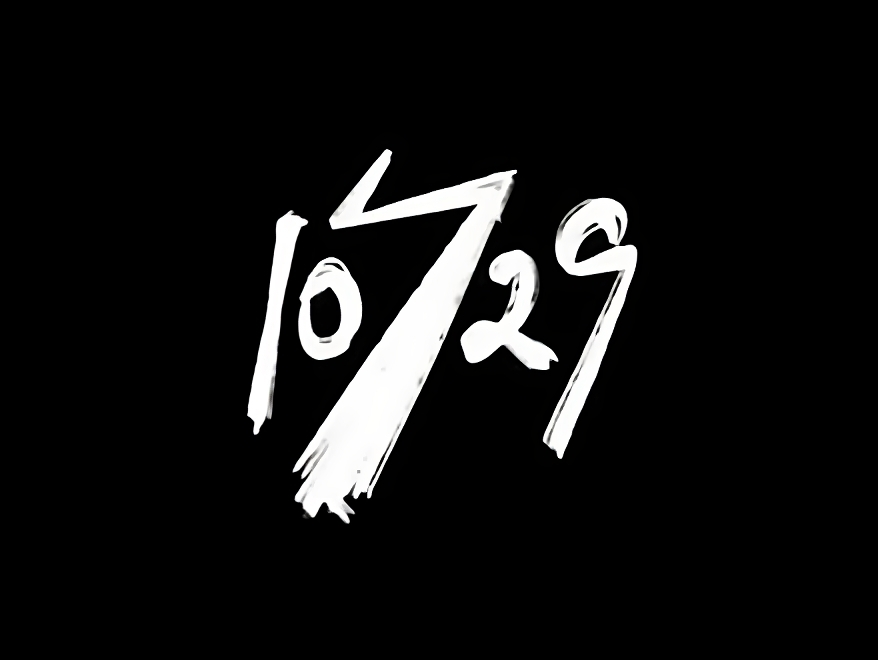

# ERYING-i9-11900H-ES-Hackintosh
**TEST-ONLY** EFI for the Erying M-ATX motherboard with the i9 11900H/11980HK ES CPU

### ⚠️ Disclaimer:
- This EFI is currently **undergoing testing** and is not recommended for daily use. Keep in mind that minor to major changes may occur during this testing phase. It serves as an example for creating your own EFI, ensuring you can troubleshoot issues that might occur during the process. Keep in mind that future updates may not be regular, especially if there are no major changes to OpenCore. Before proceeding, please read the entire README carefully to avoid missing important details.
- The EFI is not cleaned from garbage or useless things yet
- Please, Change the **[SMBIOS serial number](https://github.com/Forte500/ERYING-i9-11900H-ES-Hackintosh#%EF%B8%8F-setup)** before using the EFI
##

### ⚠️ BIOS Disclaimer:

~~This EFI is built based on the "Lightning BIOS", if you are still using the default bios be aware that you probably need to redo the USB Mapping process, + audio didn't worked at all for me with every codec for ALC 897.~~

~~If you decide to flash the lightning bios I **strongly recommend** to already have a bios programmer such as **CH341A**, It has happened to some people to have [**bricked their motherboard**](https://www.reddit.com/r/EryingMotherboard/comments/15f132j/well_i_bricked_my_motherboard/) during this process.~~

~~**[Lightning BIOS reddit post](https://www.reddit.com/r/EryingMotherboard/comments/12xg3n6/thoughts_on_the_more_powerful_bios/)**~~

Starting with the 1.4 update, this EFI now supports by default the original BIOS (`THM570111` version), as the main issues have been figured out. There are two USB mapping kexts included:

- `UTBMap111.kext` for the stock BIOS (enabled by default)
- `UTBMap10729.kext` for the Lightning BIOS (disabled by default)

If you plan to use the Lightning BIOS, you'll need to enable the `UTBMap10729.kext` and disable `UTBMap111.kext`. However, it's important to note that during the process of reinstalling the original BIOS, I encountered an issue that bricked the motherboard. To recover, I had to use the CH341A programmer to manually flash the stock BIOS.

Therefore, I **strongly recommend** to have a CH341A programmer on hand, as it can be a lifesaver in case of any bricking issues.

### 💻 My Hardware
| Component      | Brand/info                                              |
|----------------|---------------------------------------------------------|
| **CPU**        | `Intel Core i9 11900H ES Tiger Lake-H`                  |
| **Motherboard**| `THM5071xx variant`                                     |
| **BIOS Ver.**  | `THM570111`                                             |
| **RAM**        | `16gb 2*8 Crucial ballistix 3200mhz`                    |
| **Storage 1**  | `500GB Crucial MX500`                                   |
| **Storage 2**  | `Crucial P3 Plus 1TB` (for Windows)                     |
| **iGPU**       | `Intel UHD graphics xe 32eus (vesa mode/disabled)`      |
| **dGPU**       | `XFX RX 6600 XT QICK 308`                               |
| **Audio**      | `ALC897 - layout 99 or 12`, `layout 67(custom AppleALC needed)`|
| **Ethernet**   | `Realtek Gigabit Ethernet`                              |
| **PSU**        | `Cooler Master MWE 600W White V2`                       |
| **WiFi**       | N/A (can be added)                                      |

### ✅️ What works</strong>

- GPU graphics acceleration RX 6600 XT with Resizable Bar Enabled
- Audio (sort of, check [this chart](https://github.com/Forte500/ERYING-i9-11900H-ES-Hackintosh#%EF%B8%8F-known-issues) under Audio section for more info)
- Fan Readings & Control
- USB ports
- Ethernet
- Safari DRM Video Playback
- OTA Updates
- Power management
  

### ❌️ What doesn't work

- some audio ports (check [this chart](https://github.com/Forte500/ERYING-i9-11900H-ES-Hackintosh#%EF%B8%8F-known-issues) under Audio section for more info)
- Intel iGPU (no drivers)
- Sleep (probably related to Bios)
- **+ other things**

### ⚠️ Known Issues

<strong>🔊 Audio</strong>

 
  
Apparently there is no fully working audio layout for this erying board

|          | Layout 12 | layout 67 (custom) | layout 98 | Layout 99 |
| ------ | --- | --- | --- | --- |
| Rear line out (green)   | ✅️ | ✅️ | ✅️ | ✅️ |
| Rear line in (blue)  | ✅️ | ✅️ | ✅️ | ❌️ |
| Rear Mic in (Pink)  | ✅️ | ❌️ | ❌️ | ✅️ |
| Front Headphone out  | ❌️ | ❌️ | ❌️ | ✅️ |
| Front Mic in  | ❌️⚠️(noise) | ❌️ | ❌️ | ❌️ |

 

- ~~Possible Performance issues CPU-side: random TDP drops from 70W to 35W under load~~ Should have been solved with the Stock BIOS
- ~~After Verbose, there's a blackscreen for 2-3 minutes when booting off amd gpu~~
should have been solved with the `-wegswitchgpu` bootarg, which disable the internal GPU when an external GPU is installed

### 👨‍🔧 For those who haves an unsupported GPU </strong>

  
If your GPU is not officially supported, you can still try out MacOS without graphics acceleration by utilizing the integrated Intel GPU. To do this, you'll need to add the `-wegnoegpu` boot argument and remove the `-wegswitchgpu`.

However, there is an ongoing WhateverGreen fork made by a developer named [lshbluesky](https://github.com/lshbluesky) which aims to enable proper graphics acceleration for the 11th and 12th gen Intel iGPUs, which are unsupported by macOS. While full acceleration is not yet achieved, their work has successfully unlocked the entire 1536MB of VRAM, a significant improvement over the default 7MB VRAM allocation.

**Useful links:**
- [WhateverGreen fork by lshbluesky](https://github.com/lshbluesky/WhateverGreen)
- [InsanelyMac Thread](https://www.insanelymac.com/forum/topic/358305-80-solved-iris-xe-igpu-on-tiger-lake-successfully-loaded-icllp-frambuffer-and-vram-also-recognizes-1536mb-however-some-issues/)

## ⚙️ Setup

<strong>🔧 BIOS Settings (STOCK BIOS)</strong>

   

### Advanced TAB
- `PCI Subsystem Settings > Re-Size BAR Support`: must be **Enabled**
- `USB Configuration > XHCI Hand-off`: must be **Enabled**
- `Power & Performance > CPU - Power Management Control > Cpu Lock Configuration > CFG Lock` & `Overclocking Lock` must be **Both Disabled**

### Chipset TAB
**PCH-IO Configuration:**
- `SATA And RST Configuration > SATA Mode Selection`: must be set to **AHCI**
- `HD Audio Subsystem Configuration Settings > SSP #1`: must be **Enabled** in order to get working Audio

**System Agent (SA) Configuration:**
- `VT-d`: should be **Enabled**
- `Graphics Configuration > Internal Graphics`: should be set to **Auto**
- `Graphics Configuration > Primary Display`: should be set to **Auto**

### Boot TAB
- `Fast Boot`: should be **Disabled**

### Security TAB
- `Secure Boot > Secure Boot`: must be **Disabled**

<strong>🔥 OC and Power Limit Optimization (Work in Progress)</strong>

### ⚠️ Disclaimer:

Overclocking your CPU can cause excessive heat, potentially damaging your VRM if you don't have the improved VRM heatsink version and degrading your chip over time. Keep in mind that I am using liquid metal for additional cooling, so your settings may need to be different. Proceed with caution, as overclocking can lead to permanent damage or failure. I am not responsible for any damage. Use at your own risk.
##
### Advanced TAB > Power & Performance > CPU - Power Management Control

`Boot performance mode`: **Turbo performance**

`Config TDP Configurations`:
- Power Limit 1: 95000
- Power limit 2: 90000
- Power Limit 1 Time Window: 0

`View/Configure Turbo Options`:
- Core 1: 48x (default)
- Core 2: 47x (default)
- Core 3: 46x (default)
- Core 4: 45x (default)
- Core 5: 45x (from 44x)
- Core 6: 45x (from 43x)
- Core 7: 45x (from 42x)
- Core 8: 45x (from 41x)

<strong>🔧 BIOS Settings (LIGHTNING BIOS)</strong>

   

**Advanced TAB**
- `SATA Configuration > SATA Mode Selection`: must be set to **AHCI**
- `Graphics Configuration > VT-d`: should be **Enabled**
- `Graphics Configuration > Internal Graphics`: should be set to **Auto**
- `Graphics Configuration > Primary Display`: should be set to **Auto**
- `PCI Subsystem Settings > Above 4G Decoding & Re-Size BAR Support`: must be **Both Enabled**
- `USB Configuration > XHCI Hand-off`: must be **Enabled**

**Startup TAB**
- `Fast Boot`: should be **Disabled**

**Security TAB**
- `Secure Boot > Secure Boot`: must be **Disabled**

<strong>🗒 config.plist edits</strong>

   
  
- ### Default keyboard layout and language:
 *optional:* edit `prev-lang:kbd` in config.plist in order to match your keyboard layout and language (mainly relevant in recovery and installation)
  
  default is (<>) which will force the Language Picker to appear at first boot up.
  More info [here](https://dortania.github.io/OpenCore-Install-Guide/config-laptop.plist/coffee-lake-plus.html#nvram) at the bottom of `7C436110...` etc.
  
  
- ### Generating SMBIOS:

We need a tool, called [GenSMBIOS](https://github.com/corpnewt/GenSMBIOS) from corpnewt, to generate a fake serial number, UUID and MLB for our Hackintosh.

**this step is mandatory to get working iServices, be careful not to make any mistakes**

1. Download GenSMBIOS from the link above as .ZIP, then extract it.
2. Start GenSMBIOS and select option `1` to download and install MacSerial
3. Select option `2` and open the `config.plist` located under `EFI > OC`
4. Select option `3` and enter `iMacPro1,1`, serials will be generated
5. **IMPORTANT:** reminder that you need an **invalid serial!** to check copy and paste the second part saying `Serial: XXXXX..` in [Apple's Check Coverage Page](https://checkcoverage.apple.com/), if you get a red message saying "We're sorry, we're unable to check coverage for this serial number."
 then, you're good to go! Otherwise, go back and restart from step `2` (more info [here](https://dortania.github.io/OpenCore-Post-Install/universal/iservices.html#serial-number-validity))

